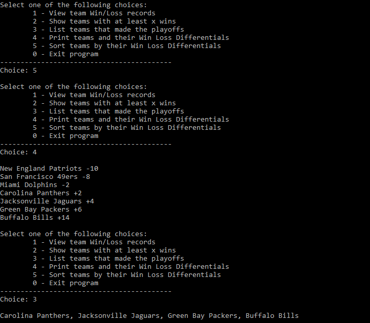

# OOP
This repository contains C++ programs that explore the concepts of object-oriented programming. Each project was created and compiled using Visual Studio 2017. Each program was developed according to strict requirements and integrates basic mathematical algorithms with C++'s native API. 

## Data Manipulation 
This program takes input from an external file (with validation) and allows the user to output various statistics from the raw data. Data can then be reordered based on this data. In this case, the program is outputting data about football team statistics. View screenshots of the output below and download the source code [here](teams.cpp).

## Monty Hall Problem
This program allows the user to play a game based on the famous probability puzzle of Monty Hall. This puzzle tests whether the correct door can be guessed successfully after being given a second chance. The program implements randomization and control flow to reflect the probablities inherent to the Monty Hall problem. View screenshots of the output below and download the source code [here](monty.cpp).

## Array Manipulation
This program allows the user to create, sort, and manipulate a basic array object based on their own input. The user is given a menu option and the ability to manipulate the array based on index. View the screenshots of the output below and download the source code [here](arrays.cpp).

